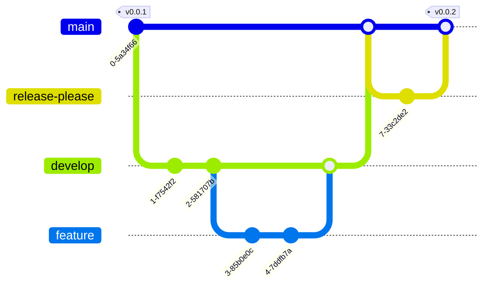
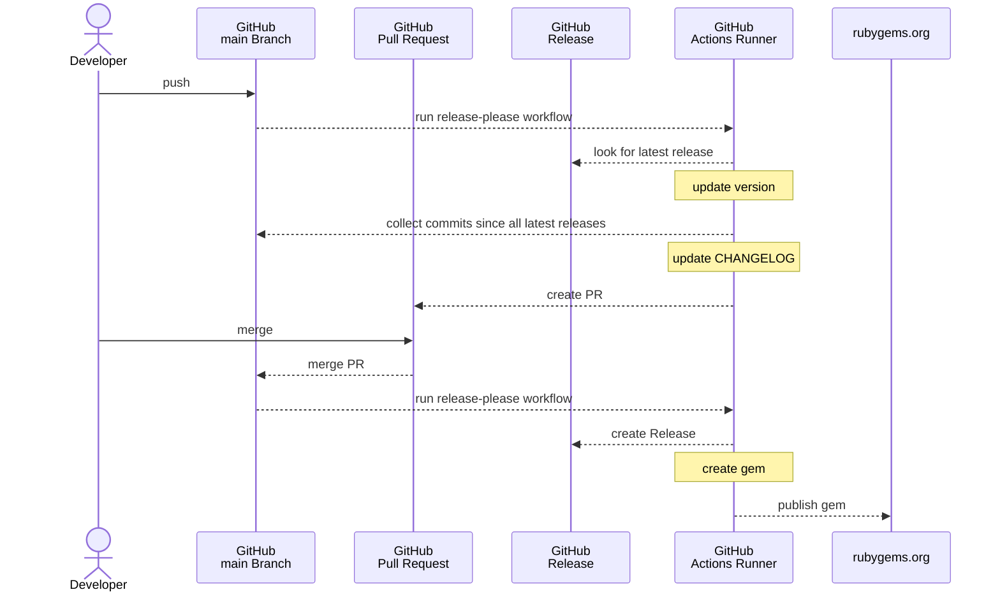

# Workflow

## Development

```mermaid
gitGraph

commit tag: "v0.0.1"
    branch develop order: 3
    commit
    commit
      branch feature order: 4
      commit
      commit
    checkout develop
    merge feature
checkout main
merge develop
  branch release-please order: 2
  commit
checkout main
merge release-please tag: "v0.0.2"
```

### Release

```mermaid
sequenceDiagram

actor user as Developer
participant main as GitHub<br />main Branch
participant pr as GitHub<br />Pull Request
participant release as GitHub<br />Release
participant runner as GitHub<br />Actions Runner
participant gem as rubygems.org

user ->> main: push
  main -->> runner: run release-please workflow
        runner -->> release: look for latest release
          Note over runner: update version
  runner -->> main: collect commits since all latest releases
          Note over runner: update CHANGELOG
    runner -->> pr: create PR
user ->> pr: merge
  pr -->> main: merge PR
  main -->> runner: run release-please workflow
    runner -->> release: create Release
          Note over runner: create gem
          runner -->> gem: publish gem
```
